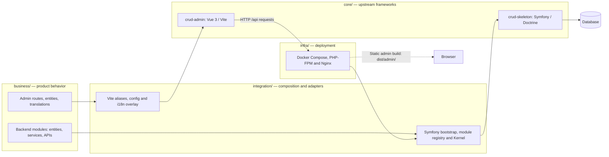

# ns-ultimate

Integrated application built from two upstream cores and project-owned business modules.

## Repository layout

- `core/crud-admin/` — Vue 3 admin frontend, tracked as a Git subtree of `immane/crud-admin`.
- `core/crud-skeleton/` — Symfony backend, tracked as a Git subtree of `immane/crud-skeleton`.
- `integration/` — project-owned application wiring and adapters between core and business modules.
- `business/` — all project-specific frontend and backend business functionality.
- `docs/` — architecture, development boundaries, and upstream synchronization guidance.

Keep upstream code intact where possible. Put product behavior in `business/`, and keep `integration/` focused on registration and adaptation. If a reusable extension point is missing, make the smallest generic change in the relevant core and submit it upstream via a branch and PR.

See [docs/README.md](docs/README.md) for documentation, [the architecture guide](docs/design/architecture.md) before adding modules, and [the subtree workflow](docs/operations/core-sync.md) before updating a core.

## Local development

```sh
make install
make dev-init # optional: configure local MySQL, migrate, create the initial admin
make dev
```

`make dev-init` prompts for local MySQL access and generates an admin password stored under `var/keys/`. For the SQLite-only basic setup, use `make env-init` instead. Use `make help` for commands and [the development guide](docs/operations/development.md) for env management, debugging, and checks.

## Quickstart and deployment

- [README.zh-cn.md](README.zh-cn.md) — 简体中文项目介绍与架构概览。
- [QUICKSTART.md](QUICKSTART.md) — install PHP 8.5, Composer 2, Node.js/npm, run the app, and execute tests.
- [QUICKSTART.zh-cn.md](QUICKSTART.zh-cn.md) — 简体中文快速开始。
- [DEPLOY.md](DEPLOY.md) — detailed non-Docker production deployment and `.env` configuration.
- [DEPLOY.zh-cn.md](DEPLOY.zh-cn.md) — 简体中文部署指南。
- [Docker Compose/Nginx foundation](infra/docker/README.md) — project-owned container build and service topology.
- [Docker Compose/Nginx 基础设施（简体中文）](infra/docker/README.zh-cn.md)
- [Local development and debugging](docs/operations/development.md) — env precedence, debugging, and validation reference.
- [CI workflow](.github/workflows/ci.yaml) — project composition checks; upstream core test suites are intentionally excluded.

## Architecture



Business modules own domain behavior; integration owns only wiring. The admin and API are built from separate upstream cores and composed into one deployable application. See the [architecture guide](docs/design/architecture.md) and [system contracts](docs/contracts/README.md).

## Project-owned code and upstream licenses

Project-owned code and documentation outside `core/` are licensed under the [MIT License](LICENSE), copyright Lam K. The upstream subtrees and third-party components remain under their respective licenses and notices.

The admin core is MIT-licensed. The backend core currently identifies itself as Apache-2.0 in its `LICENSE` and `composer.json`. Preserve each core's license and notices when redistributing it.
