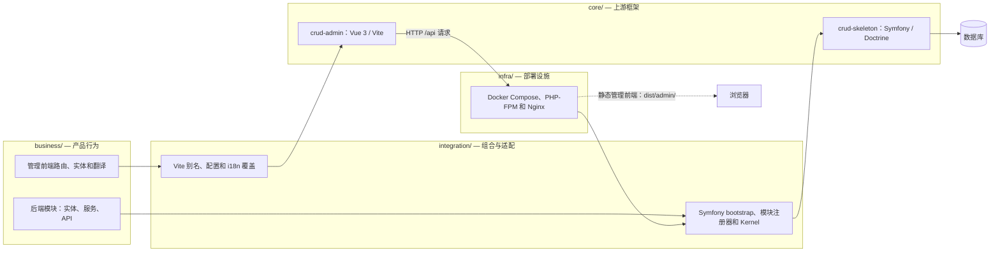

# ns-ultimate

本项目由两个上游核心仓库和项目自有业务模块组合而成。

## 仓库结构

- `core/crud-admin/` — Vue 3 管理前端，以 Git subtree 方式跟踪 `immane/crud-admin`。
- `core/crud-skeleton/` — Symfony 后端，以 Git subtree 方式跟踪 `immane/crud-skeleton`。
- `integration/` — 项目自有的应用组合层及 core 与业务模块之间的适配器。
- `business/` — 所有项目特定的前后端业务功能。
- `docs/` — 架构、开发边界和上游同步说明。

尽量保持上游代码不变。产品行为放在 `business/`，`integration/` 仅负责注册和适配。若缺少可复用的扩展点，应在对应 core 中进行最小化的通用修改，并通过分支和 PR 提交上游。

有关文档索引、添加模块前应阅读的[架构指南](docs/design/architecture.md)，以及更新 core 前应遵循的[subtree 工作流](docs/operations/core-sync.md)，请参阅 [`docs/README.md`](docs/README.md)。

## 本地开发

```sh
make install
make env-init
make dev
```

运行 `make help` 查看所有命令；环境管理、调试和检查说明见[开发指南](docs/operations/development.md)。

## 快速开始与部署

- [QUICKSTART.md](QUICKSTART.md) — 安装 PHP 8.5、Composer 2、Node.js/npm，启动应用并运行测试。
- [QUICKSTART.zh-cn.md](QUICKSTART.zh-cn.md) — 简体中文快速开始。
- [DEPLOY.md](DEPLOY.md) — 详细的非 Docker 生产部署和 `.env` 配置。
- [DEPLOY.zh-cn.md](DEPLOY.zh-cn.md) — 简体中文部署指南。
- [Docker Compose/Nginx foundation](infra/docker/README.md) — 项目自有容器构建与服务拓扑。
- [Docker Compose/Nginx 基础设施（简体中文）](infra/docker/README.zh-cn.md)
- [本地开发与调试](docs/operations/development.md) — 环境文件优先级、调试和验证参考。

## 架构



业务模块拥有领域行为；集成层只负责接线。管理前端和 API 由不同的上游 core 构建，并组合为一个可部署应用。详见[架构指南](docs/design/architecture.md)和[系统契约](docs/contracts/README.md)。

## 上游许可证

管理前端 core 使用 MIT 许可证。后端 core 的 `LICENSE` 和 `composer.json` 当前声明 Apache-2.0。重新分发时请保留各 core 的许可证及归属声明。
